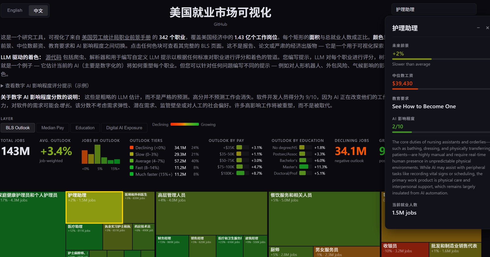

# 美国就业市场可视化工具

本项目是 [Andrej Karpathy 原始项目](https://github.com/karpathy/jobs) 的修改版本，作为用于可视化探索美国劳工统计局[职业展望手册](https://www.bls.gov/ooh/)数据的研究工具。

**[English README](README.md)** | **在线演示：[karpathy.ai/jobs](https://jobs-w-search.vercel.app/)**

## 与 Karpathy 原版的主要区别

- **双语支持** — 英文/中文语言切换，包含全部 342 个职业和类别的中文翻译
- **职业搜索** — 带自动补全功能的搜索框，支持中英文快速查找职业
- **高亮显示** - 在treemap视图中高亮显示找到的职业



## 项目内容

BLS OOH 涵盖了美国经济各部门的 **342 种职业**，包含详细的工作职责、工作环境、教育要求、薪资和就业预测数据。我们抓取了所有这些数据，并构建了一个交互式树状图可视化工具，其中每个矩形的**面积**与总就业人数成正比，**颜色**显示所选指标 — 可在 BLS 预测增长前景、中位数薪资、教育要求和 AI 影响程度之间切换。

## LLM 驱动的着色

仓库包含爬虫、解析器和用于编写自定义 LLM 提示的管道，可根据任何标准对职业进行评分和着色。你编写提示，LLM 对每个职业进行评分，树状图相应着色。"数字 AI 影响程度" 层就是一个例子 — 它估算当前 AI（主要是数字 AI）将如何重塑每个职业。但你可以为任何问题编写不同的提示 — 例如人形机器人暴露风险、外包风险、气候影响 — 并重新运行管道以获得不同的着色。参见 `score.py` 了解提示和评分管道。

**"AI 影响程度" 不是什么：**
- 它**不**预测职业会消失。软件开发者评分为 9/10，因为 AI 正在改变他们的工作 — 但随着每个开发者变得更高效，对软件的需求可能*增长*。
- 它**不**考虑需求弹性、潜在需求、监管壁垒或对人类工作者的社会偏好。
- 评分是粗略的 LLM 估算（通过 OpenRouter 使用 Gemini Flash），不是严谨的预测。许多高影响职业将被重塑，而非被替代。

## 数据管道

1. **爬取** (`scrape.py`) — Playwright（非无头模式，BLS 封锁机器人）将所有 342 个职业页面的原始 HTML 下载到 `html/`。
2. **解析** (`parse_detail.py`, `process.py`) — BeautifulSoup 将原始 HTML 转换为 `pages/` 中的干净 Markdown 文件。
3. **制表** (`make_csv.py`) — 将结构化字段（薪资、教育、就业人数、增长前景、SOC 代码）提取到 `occupations.csv`。
4. **评分** (`score.py`) — 使用评分标准将每个职业的 Markdown 描述发送给 LLM。每个职业获得 0-10 分的 AI 影响分数和理由。结果保存到 `scores.json`。可以分支编写自己的提示。
5. **构建网站数据** (`build_site_data.py`) — 将 CSV 统计数据和 AI 影响分数合并到前端使用的紧凑 `site/data.json` 中。
6. **网站** (`site/index.html`) — 交互式树状图可视化，有四个颜色层：BLS 前景、中位数薪资、教育和数字 AI 影响程度。

## 关键文件

| 文件 | 描述 |
|------|-------------|
| `occupations.json` | 342 种职业的主列表，包含标题、URL、类别、slug |
| `occupations.csv` | 汇总统计：薪资、教育、就业人数、增长预测 |
| `scores.json` | AI 影响评分（0-10）及所有 342 种职业的理由 |
| `prompt.md` | 所有数据的单个文件，设计为粘贴到 LLM 中进行分析 |
| `html/` | 来自 BLS 的原始 HTML 页面（真实来源，约 40MB） |
| `pages/` | 每个职业页面的干净 Markdown 版本 |
| `site/` | 静态网站（树状图可视化） |

## LLM 提示

[`prompt.md`](prompt.md) 将所有数据 — 汇总统计、层级细分、按薪资/教育的影响程度、BLS 增长预测以及所有 342 种职业及其评分和理由 — 打包到单个文件（约 45K tokens）中，设计为粘贴到 LLM 中。这让你能够进行关于 AI 对就业市场影响的数据驱动对话，而无需运行任何代码。使用 `uv run python make_prompt.py` 重新生成。

## 安装

```
uv sync
uv run playwright install chromium
```

需要 `.env` 中的 OpenRouter API 密钥：
```
OPENROUTER_API_KEY=your_key_here
```

## 使用

```bash
# 爬取 BLS 页面（只需一次，结果缓存在 html/ 中）
uv run python scrape.py

# 从 HTML 生成 Markdown
uv run python process.py

# 生成 CSV 汇总
uv run python make_csv.py

# 评分 AI 影响程度（使用 OpenRouter API）
uv run python score.py

# 构建网站数据
uv run python build_site_data.py

# 本地运行网站
cd site && python -m http.server 8000
```
